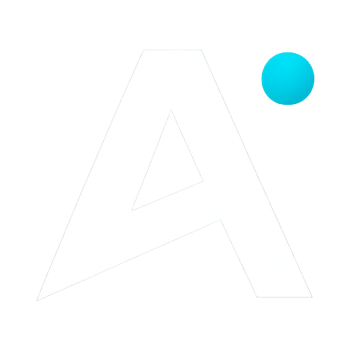
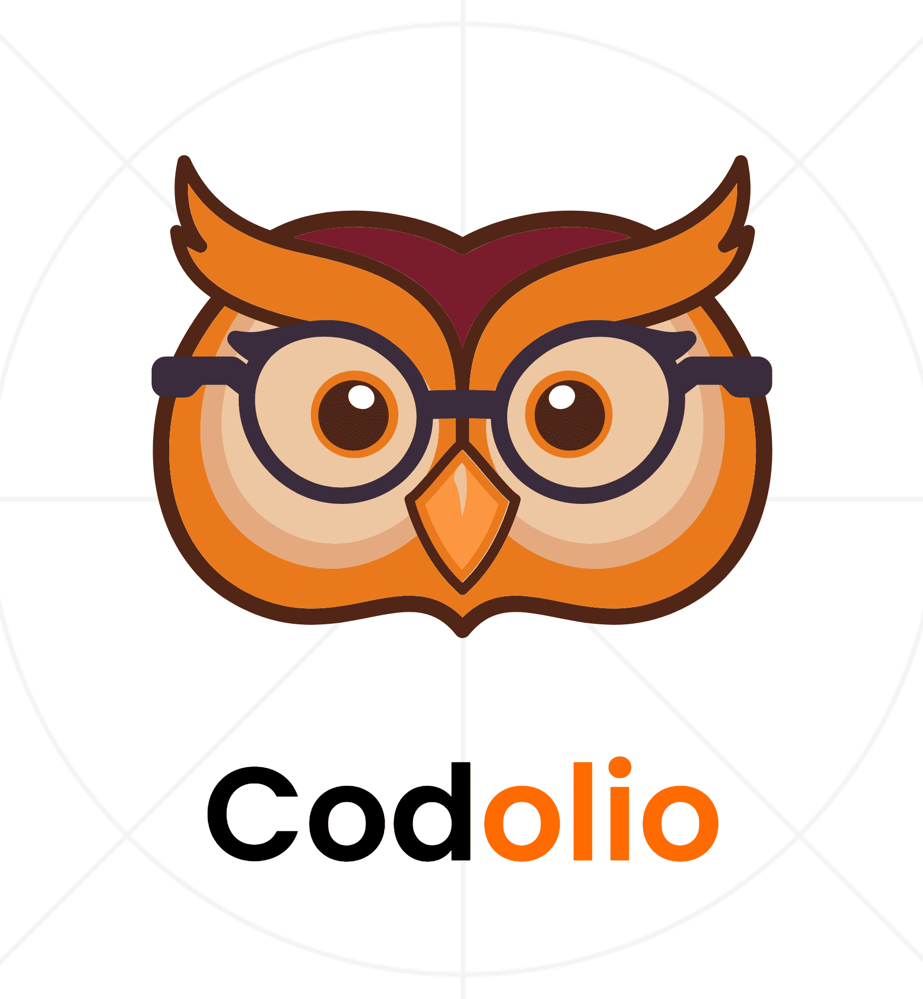
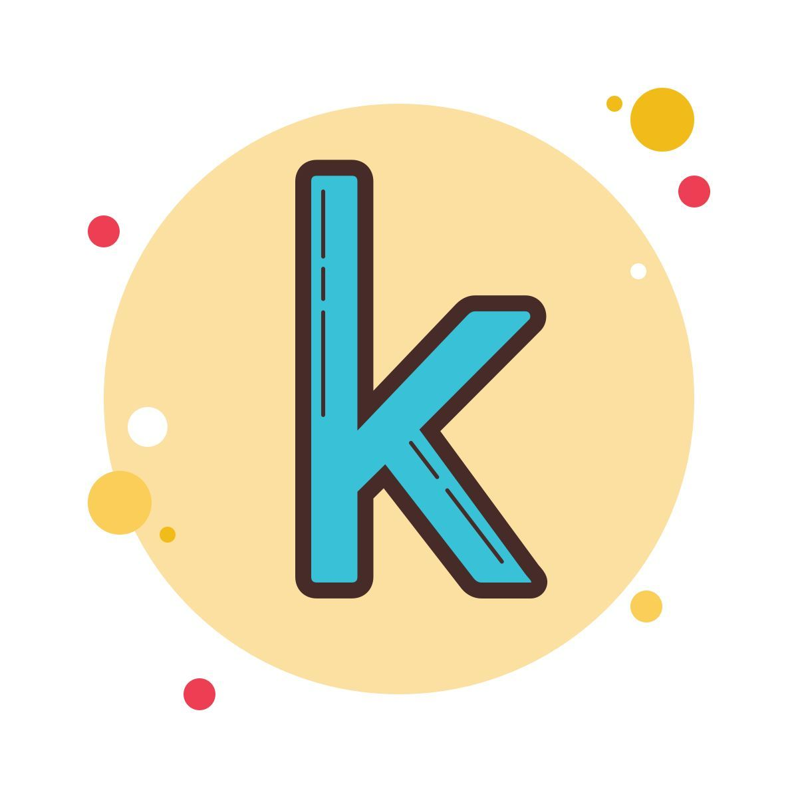
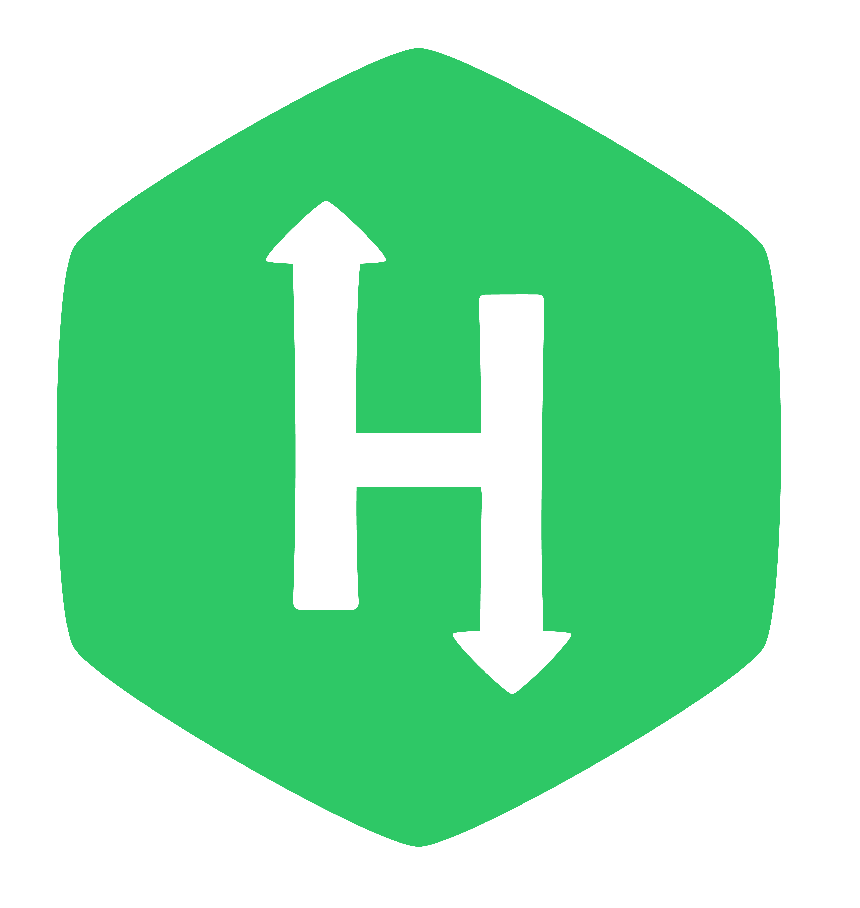
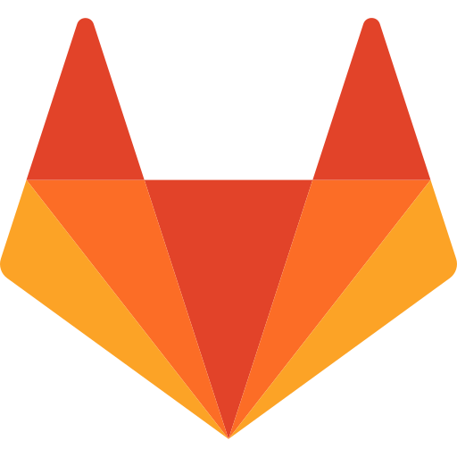
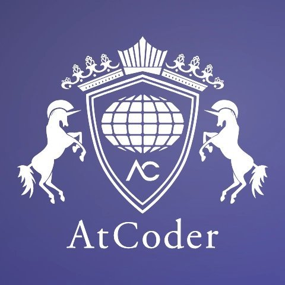
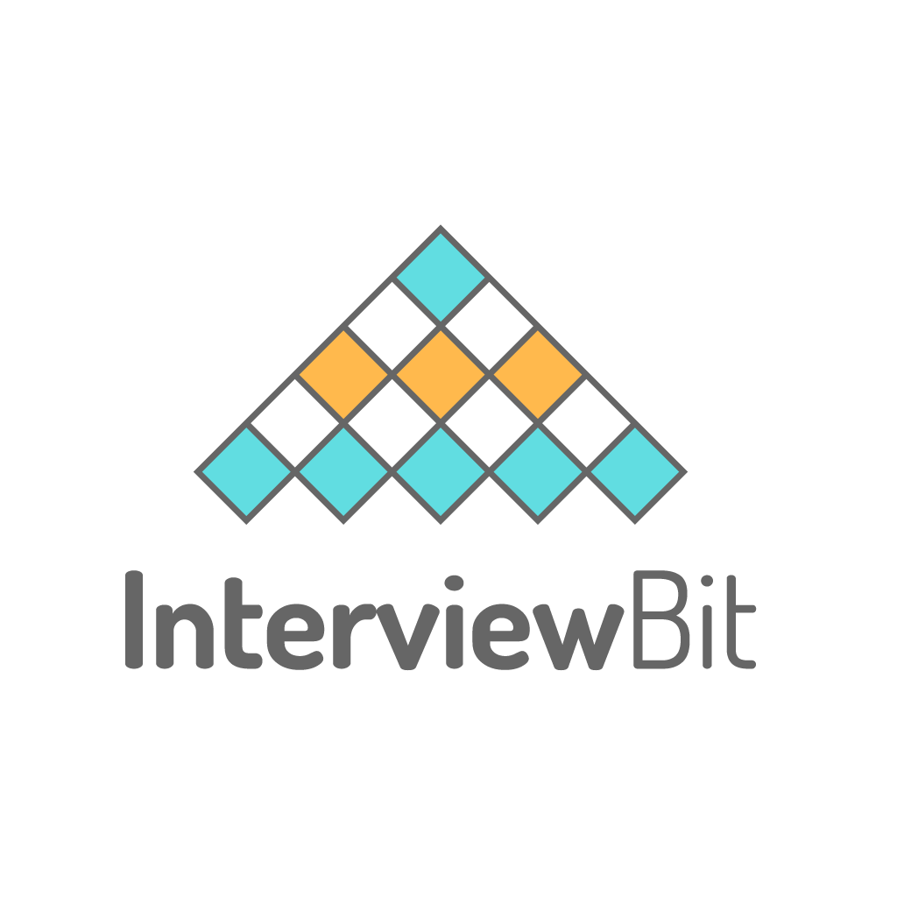
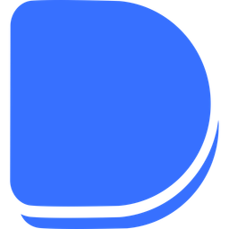

 

---

## 👋 About Me

> Backbencher from India 🇮🇳 who builds smart solutions with code.
> Currently mastering Machine Learning 🧠 — turning data into decisions, one model at a time.

---

## 🛠️ Skills

### 💻 Languages

### 🎨 Frontend

### ⚙️ Backend

### 🤖 ML & Data

### 🛠️ Tools

---

## 📊 GitHub Stats

 

 

---

### 📈 Activity

---

### 🏆 Trophies

---

### 🏅 Badges & Achievements

---

### 🌐 Find Me Everywhere

## 

---

&nbsp;

 

_"Efficiency + Innovation + Adaptability + Analytical Thinking = Who I Am"_

 

